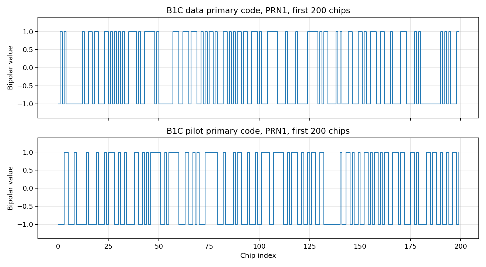
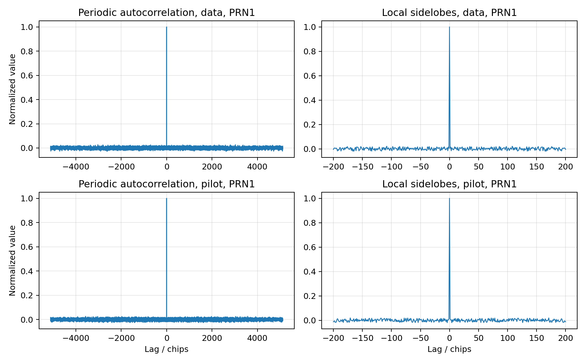
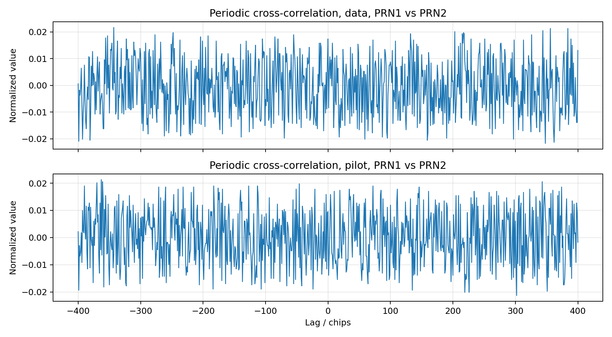
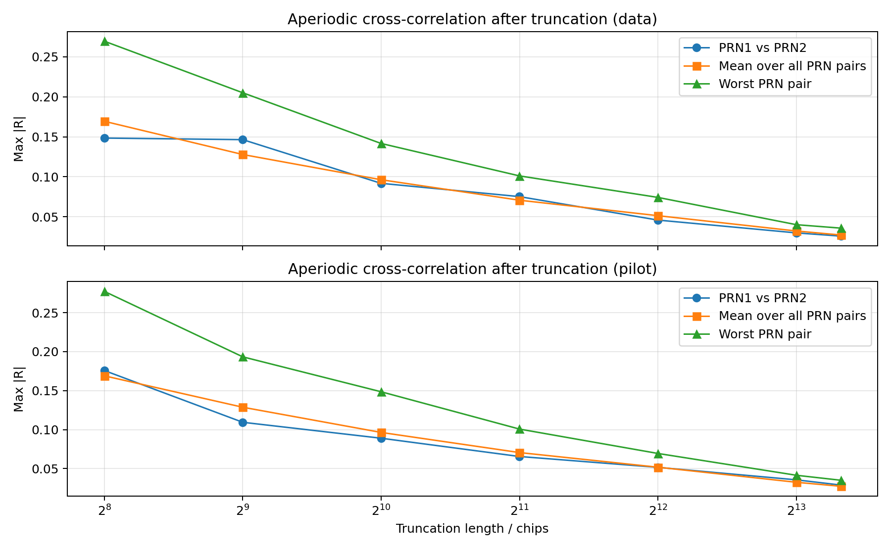
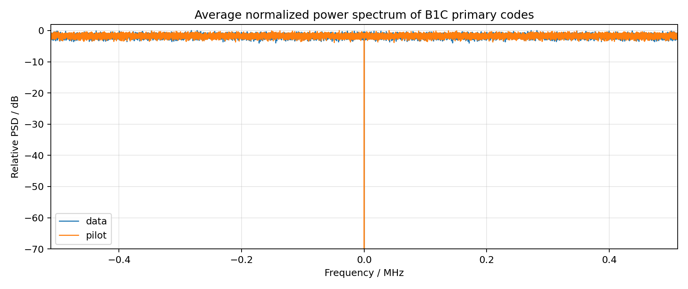

# 北斗 B1C 信号主码 Python 仿真与评估

## 1. 任务目标

本任务依据《北斗卫星导航系统空间信号接口控制文件 公开服务信号 B1C（1.0 版）》实现 B1C 信号主码的 Python 仿真，并结合导航系统对伪随机测距码的常用评价方法完成结果分析。主要内容包括：

1. 按 ICD 定义生成 B1C 数据分量和导频分量主码。
2. 用程序校验生成结果与 ICD 表 5-2、表 5-3 的头 24 位和尾 24 位是否一致。
3. 分别对数据分量和导频分量进行平衡性、自相关、不同 PRN 间互相关和功率谱分析。
4. 研究主码截断为不同长度后，不同 PRN 间有限长度互相关最大值的变化规律，说明截断长度对码分性能和接收机区分能力的影响。

本次工作只针对 B1C 主码，不包含导频子码生成和 B1C 复合调制仿真。

## 2. 理论依据与评价指标

根据 ICD 第 5 章，B1C 主码由长度为 `N=10243` 的 Weil 码截短得到，主码长度为 `10230`，码速率为 `1.023 Mcps`，主码周期为 `10 ms`。其生成公式为：

1. Weil 码

   `W(k; w) = L(k) xor L((k + w) mod N), k = 0, 1, ..., N-1`

2. 主码截断

   `c(n; w, p) = W((n + p - 1) mod N; w), n = 0, 1, ..., 10229`

其中 `L(k)` 为 Legendre 序列，`w` 为相位差，`p` 为一基索引的截取点。ICD 共给出 63 组数据分量参数和 63 组导频分量参数，因此总共有 126 组主码。

对导航伪随机序列，本文采用以下评价指标：

1. 平衡性：统计 `0/1` 或 `+1/-1` 两种取值的个数差异，评估是否存在直流偏置。
2. 周期自相关：考察零延迟主峰是否尖锐、非零延迟旁瓣是否足够低。
3. 周期互相关：考察不同 PRN 之间的互相关最大值，评价不同卫星信号的可分辨性。
4. 有限长度非周期互相关：将主码截断为长度 `L` 的短序列后，计算不同 PRN 之间的相关函数最大绝对值，分析截断长度对多星区分能力的影响。
5. 功率谱：分析主码的频域能量分布，重点观察直流分量是否被抑制以及数据分量、导频分量在频域上的差异。

对于截断长度为 `L` 的双极性序列 `a_L(n)` 和 `b_L(n)`，本文采用归一化非周期互相关

`R_ab^(L)(tau) = (1 / L) * sum a_L(n) b_L(n + tau)`

并以 `max |R_ab^(L)(tau)|` 作为该长度下不同 PRN 互扰强度的评价指标。选择这个指标的原因在于：对导航接收机来说，最不利情况并不是平均互相关，而是某个延迟点出现的最大伪峰，因为它最容易抬高错误峰值、降低正确峰值与伪峰之间的区分度。

## 3. 程序设计

本次实现主要包含 4 个文件：

1. `b1c_parameters.py`
   保存由 ICD 表 5-2 和表 5-3 整理出的主码参数，包括 `w`、`p`、头 24 位八进制和尾 24 位八进制。
2. `b1c_maincode.py`
   实现主码生成、双极性映射、周期相关与有限长度非周期相关等基础算法。
3. `analyze_b1c_maincode.py`
   自动生成评估图表和统计结果，输出到 `output_eval/` 目录。
4. `report_b1c_maincode.md`
   即本文档。

整个仿真流程可以概括为：先依据平方剩余集合构造 Legendre 序列，再按参数 `w` 生成 Weil 码，随后由截取点 `p` 完成循环截取，最后围绕导航测距码的常见评价指标生成统计量和图表。

### 3.1 主码生成代码

```python
def weil_code(phase_diff):
    legendre = legendre_sequence()
    return np.bitwise_xor(legendre, np.roll(legendre, -phase_diff))

def primary_code(prn, channel="data", bipolar=False):
    phase_diff, truncation_point, _, _ = CHANNEL_TABLES[channel][prn]
    code = weil_code(phase_diff)
    start = truncation_point - 1
    indices = (np.arange(PRIMARY_CODE_LENGTH) + start) % WEIL_LENGTH
    primary = code[indices]
    return 1 - 2 * primary.astype(np.int8) if bipolar else primary
```

其中 `channel` 用于区分数据分量和导频分量。两者的生成流程完全一致，只是同一 `PRN` 在两张参数表中对应的 `w` 和 `p` 不同。

### 3.2 ICD 一致性校验代码

```python
def validate_primary_codes():
    failures = []
    for channel, table in CHANNEL_TABLES.items():
        for prn, (_, _, head_octal, tail_octal) in table.items():
            code = primary_code(prn, channel)
            if not np.array_equal(code[:24], octal24_to_bits(head_octal)):
                failures.append(f"{channel} PRN{prn} head mismatch")
            if not np.array_equal(code[-24:], octal24_to_bits(tail_octal)):
                failures.append(f"{channel} PRN{prn} tail mismatch")
    return failures
```

该校验覆盖全部 126 组主码，其中数据分量来自表 5-2，导频分量来自表 5-3。

### 3.3 相关与截断评估代码

```python
def periodic_correlation(code_a, code_b=None):
    if code_b is None:
        code_b = code_a
    seq_a = to_bipolar(code_a)
    seq_b = to_bipolar(code_b)
    spectrum = np.fft.fft(seq_a) * np.conj(np.fft.fft(seq_b))
    corr = np.fft.ifft(spectrum).real
    corr = np.roll(corr, len(corr) // 2)
    lags = np.arange(-len(corr) // 2, len(corr) - len(corr) // 2)
    return lags, corr / len(seq_a)

def aperiodic_correlation(code_a, code_b=None):
    if code_b is None:
        code_b = code_a
    seq_a = to_bipolar(code_a)
    seq_b = to_bipolar(code_b)
    nfft = 1 << (len(seq_a) + len(seq_b) - 2).bit_length()
    spectrum = np.fft.fft(seq_a, n=nfft) * np.fft.fft(seq_b[::-1], n=nfft)
    corr = np.fft.ifft(spectrum).real[: len(seq_a) + len(seq_b) - 1]
    lags = np.arange(-(len(seq_b) - 1), len(seq_a))
    return lags, corr / len(seq_a)
```

周期相关用于评价完整一周期主码的码分特性；有限长度非周期互相关用于模拟实际接收机只积累有限码长时，不同卫星 PRN 之间的互扰情况。为保证数值稳定，分析脚本统一先将 `0/1` 主码映射为 `+1/-1` 双极性序列，再进行相关和频谱分析。

## 4. 运行方法

### 4.1 校验全部主码

```powershell
python .\b1c_maincode.py --validate
```

### 4.2 查看某个 PRN 的前若干码片

```powershell
python .\b1c_maincode.py --channel data --prn 1 --chips 64
python .\b1c_maincode.py --channel pilot --prn 1 --chips 64 --bipolar
```

### 4.3 生成分析图表和统计结果

```powershell
python .\analyze_b1c_maincode.py
```

执行后会在 `output_eval/` 下生成：

1. `b1c_data_pilot_prn1_first_200chips.png`
2. `b1c_data_pilot_prn1_autocorrelation.png`
3. `b1c_data_pilot_prn1_prn2_crosscorrelation.png`
4. `b1c_data_pilot_power_spectrum.png`
5. `b1c_truncation_crosscorr.png`
6. `b1c_analysis_summary.json`

## 5. 仿真结果分析

### 5.1 ICD 一致性校验

程序对 126 组主码全部进行了头 24 位和尾 24 位校验，运行结果为：

```text
all 126 B1C primary codes validated against the ICD tables
```

这表明：

1. 主码生成公式正确。
2. 数据分量与导频分量参数表调用正确。
3. 截取点 `p` 的一基索引实现与 ICD 保持一致。

该部分是后续评估成立的前提。

### 5.2 数据分量与导频分量时域特性及平衡性

`output_eval/b1c_data_pilot_prn1_first_200chips.png` 同时给出了 PRN1 数据分量和导频分量主码前 200 个码片的双极性波形。两类主码都在 `+1` 和 `-1` 之间快速跳变，没有明显短周期重复结构，符合测距码应具备的伪随机时域特性。



平衡性方面，统计全部 63 组数据分量主码和 63 组导频分量主码后得到：

1. 数据分量：63 组主码全部完全平衡，`perfect_balance_count = 63`，最大平衡误差为 `0`。
2. 导频分量：63 组主码全部完全平衡，`perfect_balance_count = 63`，最大平衡误差为 `0`。
3. 以 PRN1 为例，数据分量和导频分量都满足 `1` 的个数 `5115`、`0` 的个数 `5115`，双极性均值均为 `0.0`。

这说明 B1C 主码在主码层面不存在直流偏置，为后续频谱抑制直流分量提供了基础。

### 5.3 周期自相关特性

`output_eval/b1c_data_pilot_prn1_autocorrelation.png` 给出了 PRN1 数据分量和导频分量的周期自相关结果。对导航测距码而言，理想特性是零延迟主峰明显、非零延迟旁瓣尽量低。



统计结果如下：

1. 数据分量 PRN1 的主峰为 `1.0000`，最大绝对旁瓣为 `0.027175`，旁瓣均方根值为 `0.009026`。
2. 导频分量 PRN1 的主峰为 `1.0000`，最大绝对旁瓣为 `0.026393`，旁瓣均方根值为 `0.009062`。
3. 从全部 PRN 的统计看，数据分量最大旁瓣最差值出现在 PRN23，为 `0.027566`；导频分量最大旁瓣最差值出现在 PRN54，也为 `0.027566`。
4. 两类主码全部 PRN 的平均最大旁瓣分别为 `0.026616` 和 `0.026678`，说明数据分量与导频分量在自相关尖锐性上处于同一量级。

因此，无论数据分量还是导频分量，其周期自相关都具备较好的主峰-旁瓣分离特性，满足码跟踪和捕获的基本要求。

### 5.4 不同 PRN 之间的周期互相关

导航系统中的互相关分析应针对不同 PRN，即不同卫星信号之间的相关性能。`output_eval/b1c_data_pilot_prn1_prn2_crosscorrelation.png` 展示了 PRN1 与 PRN2 的周期互相关结果，同时脚本进一步统计了每个通道内全部 PRN 对的最差情况。



结果表明：

1. 数据分量中，PRN1 与 PRN2 的最大绝对周期互相关值为 `0.038123`，均方根值为 `0.009871`。
2. 导频分量中，PRN1 与 PRN2 的最大绝对周期互相关值为 `0.032258`，均方根值为 `0.009944`。
3. 从全部 PRN 对统计看，数据分量的最差互相关对为 PRN38 与 PRN45，对应最大绝对值 `0.043206`。
4. 导频分量的最差互相关对为 PRN23 与 PRN34，对应最大绝对值 `0.042424`。

这些互相关最大值都远小于自相关主峰 `1.0`，说明不同卫星 PRN 在完整主码周期上具有较好的码分可分性。

### 5.5 截断长度对不同 PRN 互相关的影响

在实际接收机中，不一定总能积累完整 `10230` 码片。弱信号捕获、动态环境下的短时相关、或者较短相干积分时间的设计，都会使接收机只能看到主码的一部分。因此，除了完整周期互相关，还必须评估“截断后有限长度序列”的互相关性能。

#### 5.5.1 分析思路

这部分分析遵循以下步骤：

1. 先把主码转换为 `+1/-1` 双极性序列，使相关结果可以直接表示为归一化匹配程度。
2. 对每个通道分别处理，即数据分量只和数据分量比较，导频分量只和导频分量比较，不混合统计。
3. 选取若干截断长度 `L`，本文取 `256`、`512`、`1023`、`2046`、`4092`、`8192` 和 `10230`。
4. 对于某个长度 `L`，从每条主码开头截取前 `L` 个码片，得到有限长度序列。
5. 在同一通道内，对全部不同 PRN 对逐一计算非周期互相关函数 `R_ab^(L)(tau)`。
6. 对每一对 PRN，取全部延迟点中的最大绝对值 `max |R_ab^(L)(tau)|`，这表示该对 PRN 在长度 `L` 下可能出现的最大伪相关峰。
7. 再对该通道内所有不同 PRN 对取最差值，作为该截断长度下的通道级性能指标。

换句话说，本节关心的不是“某一对 PRN 平均上是否相关”，而是“当长度固定为 `L` 时，所有不同卫星信号里最危险的那一对 PRN，会不会出现过高的伪峰”。因为对接收机判决来说，真正影响性能的是最坏情况下的错误峰值。

#### 5.5.2 为什么要看最大值而不是平均值

如果只看平均互相关，很多正负波动会互相抵消，容易得到一个看起来很小的结果，但这并不能代表接收机一定容易区分不同卫星。实际捕获时，接收机是在许多延迟点里寻找峰值，因此只要某个非零延迟处出现较大伪峰，就可能：

1. 抬高噪声门限附近的错误检测概率。
2. 降低正确 PRN 峰值与错误 PRN 伪峰之间的峰值差。
3. 在短时积累下增加误判或虚警风险。

因此，采用 `max |R_ab^(L)(tau)|` 作为评价指标，更符合导航系统对伪随机序列区分性能的评价思路。

#### 5.5.3 仿真结果

`output_eval/b1c_truncation_crosscorr.png` 给出了数据分量和导频分量随截断长度变化的趋势。



最差 PRN 对的统计结果如下表所示：

| 截断长度 L | 数据分量最差 `max |R|` | 导频分量最差 `max |R|` |
| --- | --- | --- |
| 256 | 0.2695 | 0.2773 |
| 512 | 0.2051 | 0.1934 |
| 1023 | 0.1417 | 0.1486 |
| 2046 | 0.1012 | 0.1007 |
| 4092 | 0.0743 | 0.0694 |
| 8192 | 0.0402 | 0.0414 |
| 10230 | 0.0359 | 0.0350 |

以代表性 PRN1 与 PRN2 为例：

1. 数据分量从 `L=256` 时的 `0.1484` 下降到 `L=10230` 时的 `0.0259`。
2. 导频分量从 `L=256` 时的 `0.1758` 下降到 `L=10230` 时的 `0.0288`。

这说明不论看最差 PRN 对，还是看一组代表性 PRN，对应趋势都是一致的，即截断长度增加后，互相关伪峰整体下降。

#### 5.5.4 截断长度为什么会影响性能

这个现象可以从两个层面理解。

第一，从统计平均的角度看，伪随机序列的正负码片在做互相关时会不断相互抵消。截断长度较短时，参与相消的样本数少，局部偶然对齐带来的波动更明显，因此较容易出现偏大的互相关峰值；截断长度增加后，更多码片参与累加，正负项抵消更充分，归一化后的伪峰会下降。

第二，从接收机判决的角度看，正确 PRN 的相关主峰会随积累长度增长而保持明显，而错误 PRN 的伪峰不会按同样方式稳定增长，因此主峰与伪峰之间的分离度会变好。也就是说，截断长度越长，接收机越容易把“真正的本星信号”与“其他卫星信号造成的伪峰”区分开。

因此，截断长度对性能的影响可以概括为：

1. 长度短：非周期互相关最大值偏大，伪峰更高，区分性能较差。
2. 长度长：非周期互相关最大值减小，伪峰被压低，区分性能更好。
3. 当长度逐步接近完整主码周期时，数据分量与导频分量的最差互相关都收敛到约 `0.035` 左右，说明完整主码长度下的码分性能最稳定。

从仿真结果看，这一趋势非常清楚，因此可以把“增加积累长度有助于改善不同 PRN 的可分辨性”作为本作业中关于互相关分析的核心结论。

### 5.6 功率谱分析

`output_eval/b1c_data_pilot_power_spectrum.png` 给出了对全部 63 组数据分量主码和 63 组导频分量主码分别求平均后得到的归一化功率谱。



可见：

1. 数据分量和导频分量的功率谱都关于零频对称，符合实值双极性码序列的频谱特征。
2. 由于两类主码全部满足严格平衡，零频直流分量被完全抑制，统计结果中 `dc_relative_power = 0`。
3. 在 `0.25 Rc` 附近，数据分量相对峰值功率约为 `-1.734 dB`，导频分量约为 `-2.373 dB`。
4. 两类主码的频域包络相近，但由于参数 `w` 和截取点 `p` 不同，局部谱线分布并不完全相同。

因此，从主码层面看，B1C 数据分量和导频分量都具备较好的频谱分散特性，而且平衡性良好使其不会在直流处产生明显谱峰。

## 6. 结论

本次基于 ICD 完成了北斗 B1C 主码的 Python 仿真与评估，主要结论如下：

1. 已成功实现数据分量和导频分量共 126 组主码的生成，并全部通过 ICD 头尾码片校验。
2. 从平衡性角度看，63 组数据分量主码和 63 组导频分量主码全部严格平衡，不存在直流偏置。
3. 从周期自相关和不同 PRN 周期互相关看，两类主码都具有明显自相关主峰和较低互相关，适合导航测距和多星码分接收。
4. 从有限长度非周期互相关看，截断长度越长，不同 PRN 间最大互相关越小，说明增加积累长度能够有效改善区分性能。
5. 从功率谱角度看，数据分量和导频分量都不存在直流谱峰，频谱分散性良好。

综上，当前实现不仅完成了 B1C 主码生成与 ICD 一致性验证，也补充了符合导航序列评价思路的平衡性、功率谱和截断互相关分析，可作为后续 B1C 捕获、跟踪和扩频接收算法仿真的基础模块。

## 7. 后续可扩展内容

如果还需要继续扩展本课程作业，可以在当前基础上增加：

1. B1C 导频子码生成与联合码结构分析。
2. BOC/QMBOC 调制后的复合基带波形与功率谱分析。
3. 接收机捕获仿真，比较不同相干积分长度下的检测性能。
4. 跟踪环路中的码鉴别器和载波跟踪性能分析。
