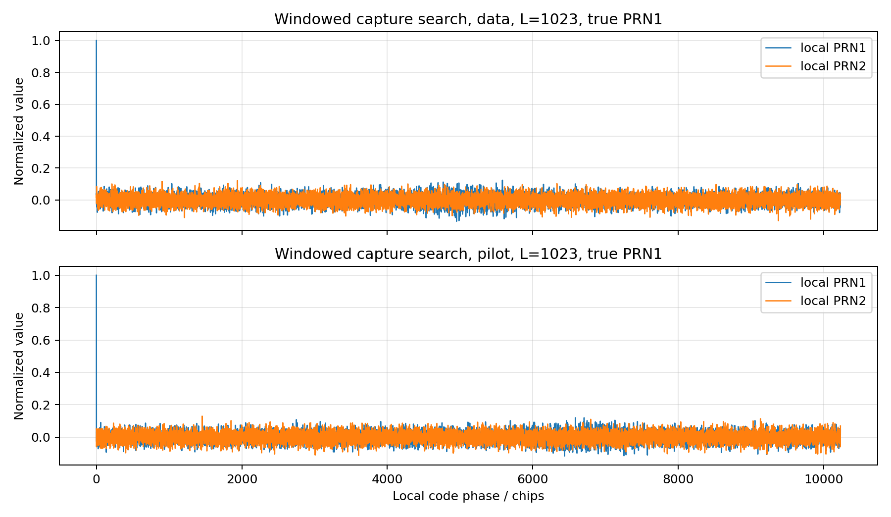
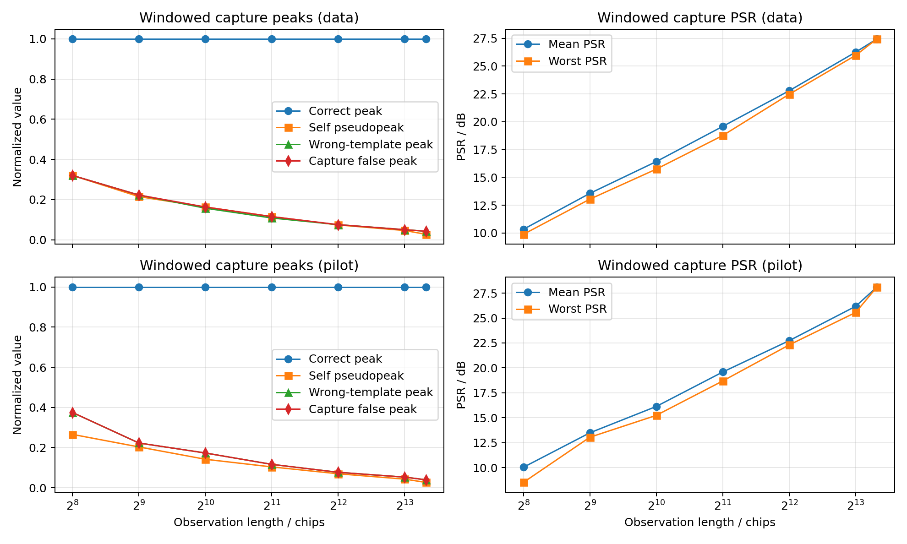

# 北斗 B1C 信号主码 Python 仿真与评估

## 1. 任务目标

依据《北斗卫星导航系统空间信号接口控制文件 公开服务信号 B1C（1.0 版）》，本文完成了 B1C 信号主码的 Python 仿真，并在此基础上做了正确性校验和相关特性分析。具体工作包括：按照 ICD 定义生成 B1C 数据分量和导频分量主码，对结果与 ICD 表 5-2、表 5-3 的头 24 位和尾 24 位进行一致性校验，并围绕平衡性、周期自相关、不同 PRN 间周期互相关、短观测窗捕获搜索以及功率谱开展分析。本文只讨论 B1C 主码本身，不涉及导频子码生成和 B1C 复合调制仿真。

## 2. 理论基础

根据 ICD 第 5 章，B1C 主码由长度为 `N=10243` 的 Weil 码截短得到。主码长度为 `10230`，码速率为 `1.023 Mcps`，周期为 `10 ms`。Weil 码由两个 Legendre 序列经相位差 `w` 组合得到，主码则从 Weil 码的第 `p` 位开始循环截取 `10230` 个码片，其中 `p` 采用一基编号。对应公式为：

1. Weil 码

   `W(k; w) = L(k) xor L((k + w) mod N), k = 0, 1, ..., N-1`

2. 主码截断

   `c(n; w, p) = W((n + p - 1) mod N; w), n = 0, 1, ..., 10229`

其中 `L(k)` 表示 Legendre 序列，`w` 是相位差，`p` 是截取点。ICD 给出了 63 组数据分量参数和 63 组导频分量参数，因此总共有 126 组主码。为了评价这些主码的使用特性，本文主要关注五类指标：一是平衡性，用来判断码片分布是否存在明显直流偏置；二是周期自相关，用来观察主峰是否尖锐、旁瓣是否足够低；三是周期互相关，用来衡量不同 PRN 之间的可分辨性；四是短观测窗捕获搜索，用来模拟接收机只能观测到部分主码时的真假峰竞争关系；五是功率谱，用来观察频域能量分布以及直流分量是否被抑制。

对于真实接收机的有限观测场景，本文不再直接比较“两段前缀截断码”的互相关，而是采用更接近捕获器的模型：先从真实 PRN 主码中截取长度为 `L`、起点为 `s` 的观测窗

`r_i^(L,s)(n) = c_i((s + n) mod N), n = 0, 1, ..., L-1`

再把这段短观测窗与本地完整主码 `c_j` 在全部码相位 `tau` 上进行搜索相关：

`R_ij^(L,s)(tau) = (1 / L) * sum r_i^(L,s)(n) c_j((tau + n) mod N)`

基于这条搜索相关曲线，本文定义四个捕获指标：

1. 正确峰 `P_c`：当 `j=i` 时相关曲线中的最大值；
2. 自伪峰 `P_s`：正确 PRN 搜索曲线中除正确峰外的最大绝对值；
3. 错误模板峰 `P_w`：所有错误 PRN 模板搜索曲线中的最大绝对值；
4. 捕获伪峰 `P_f = max(P_s, P_w)`。

进一步定义峰旁比

`PSR = P_c / P_f`

用来刻画正确峰相对最强假峰的分离程度。`PSR` 越大，说明接收机越容易把真正目标从伪峰中区分出来。

## 3. 程序实现

代码实现主要由参数表、主码生成器和分析脚本三部分组成。`b1c_parameters.py` 固化了 ICD 表 5-2 和表 5-3 中全部主码参数；`b1c_maincode.py` 负责生成主码、提供双极性映射，以及周期相关、非周期相关、短观测窗搜索相关和统一校验函数；`analyze_b1c_maincode.py` 负责生成图表和统计结果。整体流程并不复杂：先由平方剩余集合构造 Legendre 序列，再用参数 `w` 生成 Weil 码，随后按截取点 `p` 循环截取出长度为 `10230` 的主码，最后计算相关指标并输出图表。

核心生成过程如下：

```python
def weil_code(phase_diff):
    legendre = legendre_sequence()
    return np.bitwise_xor(legendre, np.roll(legendre, -phase_diff))

def primary_code(prn, channel="data", bipolar=False):
    phase_diff, truncation_point, _, _ = CHANNEL_TABLES[channel][prn]
    code = weil_code(phase_diff)
    start = truncation_point - 1
    indices = (np.arange(PRIMARY_CODE_LENGTH) + start) % WEIL_LENGTH
    primary = code[indices]
    return 1 - 2 * primary.astype(np.int8) if bipolar else primary
```

其中 `channel` 用来区分数据分量和导频分量。两类主码的生成流程相同，只是同一 `PRN` 在两张参数表中对应的 `w` 和 `p` 不一样。为了保证程序不是“看起来能跑”，而是真正和 ICD 对齐，代码中还加入了头尾 24 码片校验逻辑：

```python
def validate_primary_codes():
    failures = []
    channel_summaries = {}
    for channel, table in CHANNEL_TABLES.items():
        details = []
        for prn, (_, _, head_octal, tail_octal) in table.items():
            code = primary_code(prn, channel)
            head_calc = bits_to_octal(code[:24])
            tail_calc = bits_to_octal(code[-24:])
            details.append((prn, head_octal, head_calc, tail_octal, tail_calc))
            if head_calc != head_octal:
                failures.append(f"{channel} PRN{prn} head mismatch")
            if tail_calc != tail_octal:
                failures.append(f"{channel} PRN{prn} tail mismatch")
        channel_summaries[channel] = details
    return {"validation_failures": failures, "channels": channel_summaries}
```

在分析部分，程序先把 `0/1` 主码映射成 `+1/-1` 双极性序列，再用 FFT 计算周期相关函数和短观测窗搜索相关。这样处理后，相关结果更符合导航接收机分析中的常见表达方式，数值比较也更直观。

```python
def periodic_correlation(code_a, code_b=None):
    if code_b is None:
        code_b = code_a
    seq_a = to_bipolar(code_a)
    seq_b = to_bipolar(code_b)
    spectrum = np.fft.fft(seq_a) * np.conj(np.fft.fft(seq_b))
    corr = np.fft.ifft(spectrum).real
    corr = np.roll(corr, len(corr) // 2)
    lags = np.arange(-len(corr) // 2, len(corr) - len(corr) // 2)
    return lags, corr / len(seq_a)

def windowed_capture_correlation(observation, local_code):
    obs = to_bipolar(observation)
    ref = to_bipolar(local_code)
    padded = np.zeros(len(ref), dtype=np.float64)
    padded[: len(obs)] = obs
    spectrum = np.fft.fft(padded) * np.conj(np.fft.fft(ref))
    corr = np.fft.ifft(spectrum).real / len(obs)
    phases = np.arange(len(ref))
    return phases, corr
```

在新的捕获搜索实验中，`analyze_b1c_maincode.py` 对每个通道分别选取 `PRN1` 作为真实接收信号，在 `0、1278、2557、3835、5114、6393、7671、8950` 这 8 个均匀分布的观测起点上，分别截取长度为 `256、512、1023、2046、4092、8192、10230` 的短观测窗，并让本地完整主码在全部 `10230` 个码相位上滑动搜索，从而统计正确峰、自伪峰、错误模板峰和 `PSR` 的变化。

## 4. 校验结果

为了确认实现严格符合 ICD，程序对全部 126 组主码都做了头 24 位和尾 24 位校验，统一比较 ICD 表 5-2 与表 5-3 中给出的八进制头尾码片和程序生成结果，运行结果为：

```text
all 126 B1C primary codes validated against ICD tables 5-2 and 5-3
```

这说明主码生成公式、数据分量与导频分量参数调用方式，以及截取点 `p` 的一基索引实现都是正确的。统一校验结果显示，表 5-2 的 63 组数据分量主码和表 5-3 的 63 组导频分量主码全部匹配，没有发现任何头 24 位或尾 24 位不一致的情况。这一步先把主码生成的正确性压实了，后面的相关分析才有依据。为了避免只给出一行终端输出而缺少可检查证据，本文从两张表中各抽取若干个 PRN，把 ICD 八进制头尾码片与程序结果并列展示如下。

| 通道 | PRN | ICD头24位 | 程序头24位 | ICD尾24位 | 程序尾24位 | 结果 |
| --- | --- | --- | --- | --- | --- | --- |
| data | 1 | 53773116 | 53773116 | 42711657 | 42711657 | 通过 |
| data | 2 | 32235341 | 32235341 | 17306122 | 17306122 | 通过 |
| data | 3 | 17633713 | 17633713 | 01145221 | 01145221 | 通过 |
| data | 10 | 25432015 | 25432015 | 43004057 | 43004057 | 通过 |
| data | 63 | 27571255 | 27571255 | 47160627 | 47160627 | 通过 |
| pilot | 1 | 71676756 | 71676756 | 13053205 | 13053205 | 通过 |
| pilot | 2 | 60334021 | 60334021 | 46604773 | 46604773 | 通过 |
| pilot | 3 | 24562714 | 24562714 | 60007065 | 60007065 | 通过 |
| pilot | 10 | 00236125 | 00236125 | 76142064 | 76142064 | 通过 |
| pilot | 63 | 03210227 | 03210227 | 56250500 | 56250500 | 通过 |

## 5. 仿真结果分析

先看时域特性。`output_eval/b1c_data_pilot_prn1_first_200chips.png` 给出了 PRN1 数据分量和导频分量主码前 200 个码片的双极性波形。两类主码都在 `+1` 和 `-1` 之间快速跳变，没有明显的短周期重复结构，时域上表现出典型的伪随机特征。进一步统计全部 63 组数据分量主码和 63 组导频分量主码后可以看到，两类主码都严格平衡：每条主码中 `1` 和 `0` 的个数都各为 `5115`，最大平衡误差为 `0`，双极性均值也为 `0.0`。这说明主码本身不存在直流偏置，后面频谱中直流分量被压低，和这里的平衡性结果是一致的。


周期自相关结果见 `output_eval/b1c_data_pilot_prn1_autocorrelation.png`。对导航测距码来说，零延迟主峰是否突出、非零延迟旁瓣是否够低，是最直观的一组指标。以 PRN1 为例，数据分量主峰为 `1.0000`，最大绝对旁瓣为 `0.027175`，旁瓣均方根值为 `0.009026`；导频分量主峰同样为 `1.0000`，最大绝对旁瓣为 `0.026393`，旁瓣均方根值为 `0.009062`。如果放到全部 PRN 范围内看，数据分量最差旁瓣出现在 PRN23，对应 `0.027566`，导频分量最差旁瓣出现在 PRN54，对应值同样为 `0.027566`。这些结果说明，数据分量和导频分量在自相关主峰尖锐性上处于相近水平，旁瓣整体也压得比较低，具备良好的码同步基础。


再看不同 PRN 之间的周期互相关。`output_eval/b1c_data_pilot_prn1_prn2_crosscorrelation.png` 给出了 PRN1 与 PRN2 的互相关结果，同时脚本也统计了同一通道内全部 PRN 对的最差情况。数据分量中，PRN1 与 PRN2 的最大绝对周期互相关值为 `0.038123`，均方根值为 `0.009871`；导频分量中，这组 PRN 的最大绝对周期互相关值为 `0.032258`，均方根值为 `0.009944`。如果看全部 PRN 对，数据分量最差互相关对为 PRN38 与 PRN45，对应最大绝对值 `0.043206`；导频分量最差互相关对为 PRN23 与 PRN34，对应最大绝对值 `0.042424`。这些数值都显著低于自相关主峰 `1.0`，说明在完整主码周期内，不同卫星 PRN 之间仍然具有较好的理论可分辨性。


为了更贴近实际捕获过程，本文进一步进行了短观测窗捕获搜索实验。与原先仅比较前缀截断码段不同，这里把 `PRN1` 视为真实接收信号，从完整主码中在 8 个不同起点截取短观测窗；本地端则保留完整主码，并在全部码相位上逐点搜索相关。这样得到的相关曲线更接近接收机真正会看到的“正确峰与假峰竞争”场景。`output_eval/b1c_windowed_capture_search.png` 给出了代表性的搜索曲线示意：在 `L=1023`、观测起点为 0 时，正确模板会出现接近 `1.0` 的唯一主峰，而错误模板的相关响应明显更低。



`output_eval/b1c_windowed_capture_metrics.png` 则给出了不同观测长度下的统计趋势。由于实验中没有加入噪声和数据翻转，正确 PRN 在正确码相位上的匹配始终是精确对齐的，因此对所有 `L`，正确峰都保持在 `1.0` 左右。真正决定捕获难度的，是自伪峰和错误模板峰的高低。以数据分量为例，在 `L=256` 时，代表性窗口的正确峰为 `1.0000`，自伪峰为 `0.2656`，错误模板峰为 `0.2891`，因此捕获伪峰为 `0.2891`，`PSR` 为 `10.78 dB`；当把窗口长度增加到 `L=10230` 时，自伪峰回落到 `0.0272`，错误模板峰回落到 `0.0424`，`PSR` 提升到 `27.45 dB`。导频分量也呈现同样规律：最短窗口 `L=256` 时最差 `PSR` 为 `8.52 dB`，完整周期时提升到 `28.11 dB`。

这些结果说明，短观测窗条件下的主要风险不是“正确峰变低”，而是“假峰变高”。窗口越短，只有少量码片参与相关，正负项抵消不充分，自伪峰和错误模板峰都更容易抬升，正确峰与假峰之间的间隔变小；窗口越长，参与积分的码片越多，伪峰会整体下降，`PSR` 持续改善，接收机就越容易把真正目标从伪峰中分离出来。



不同观测长度下，按 8 个观测起点统计得到的“最强捕获伪峰”和“最差 `PSR`”如下表所示：

| 观测长度 L | 数据分量最强伪峰 | 数据分量最差 `PSR` / dB | 导频分量最强伪峰 | 导频分量最差 `PSR` / dB |
| --- | --- | --- | --- | --- |
| 256 | 0.3203 | 9.8885 | 0.3750 | 8.5194 |
| 512 | 0.2227 | 13.0473 | 0.2227 | 13.0473 |
| 1023 | 0.1632 | 15.7432 | 0.1730 | 15.2380 |
| 2046 | 0.1153 | 18.7599 | 0.1163 | 18.6866 |
| 4092 | 0.0753 | 22.4677 | 0.0767 | 22.3001 |
| 8192 | 0.0503 | 25.9699 | 0.0527 | 25.5581 |
| 10230 | 0.0424 | 27.4477 | 0.0393 | 28.1130 |

最后看功率谱。`output_eval/b1c_data_pilot_power_spectrum.png` 给出了对全部 63 组数据分量主码和 63 组导频分量主码分别求平均后得到的归一化功率谱。两类主码的频谱都关于零频对称，这和实值双极性码序列的频域特征一致。由于两类主码都严格平衡，直流分量被完全抑制，统计结果中 `dc_relative_power = 0`。在 `0.25 Rc` 附近，数据分量相对峰值功率约为 `-1.734 dB`，导频分量约为 `-2.373 dB`。整体上看，数据分量和导频分量的频谱包络比较接近，只是由于参数 `w` 和截取点 `p` 不同，局部谱线分布并不完全一样。从主码层面说，这样的频谱特性已经说明两类主码都具有较好的频谱分散性，直流分量也压得比较干净。


## 6. 结论

本文完成了北斗 B1C 数据分量和导频分量共 126 组主码的 Python 仿真，并通过 ICD 表 5-2 和表 5-3 的头尾码片校验确认了实现的正确性。仿真结果表明，B1C 主码具有严格平衡的码片分布、尖锐的自相关主峰以及较低的完整周期互相关；在更贴近真实接收机场景的短观测窗捕获搜索实验中，正确峰在无噪声条件下始终保持在 `1.0` 左右，而自伪峰和错误模板峰会随着观测长度缩短明显升高，导致 `PSR` 下降。随着观测长度从 `256` 增加到完整周期 `10230`，数据分量和导频分量的最差 `PSR` 都提升到约 `27~28 dB`，表明较长积分窗口能显著改善真假峰分离能力。功率谱分析进一步说明，两类主码都不存在明显直流谱峰，频谱分散性较好。就本文的工作范围而言，当前实现已经能够作为后续 B1C 捕获、跟踪、扩频接收以及进一步调制仿真的基础模块。
